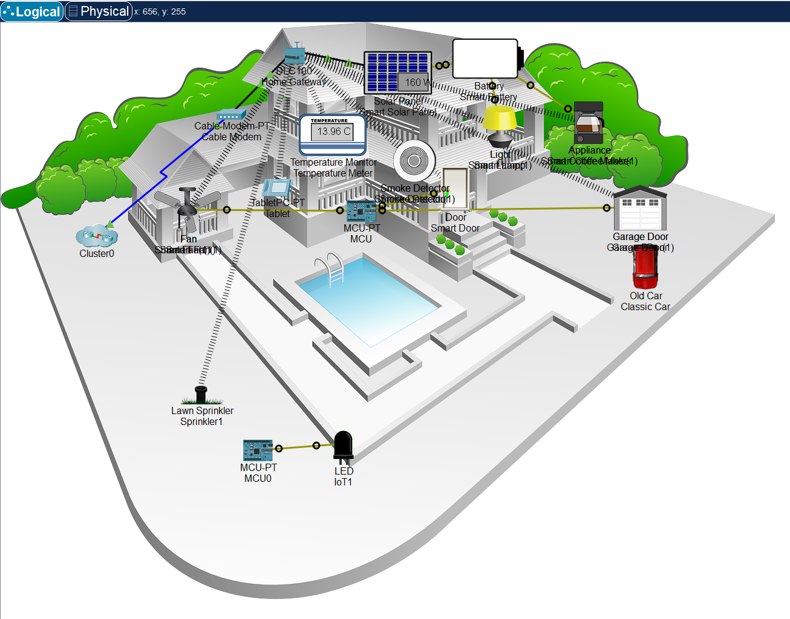
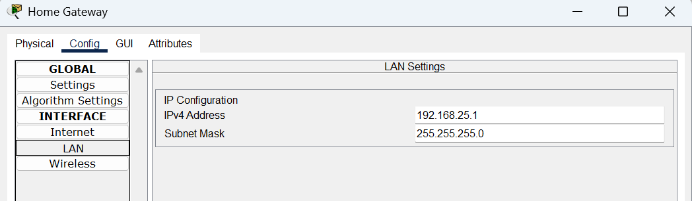
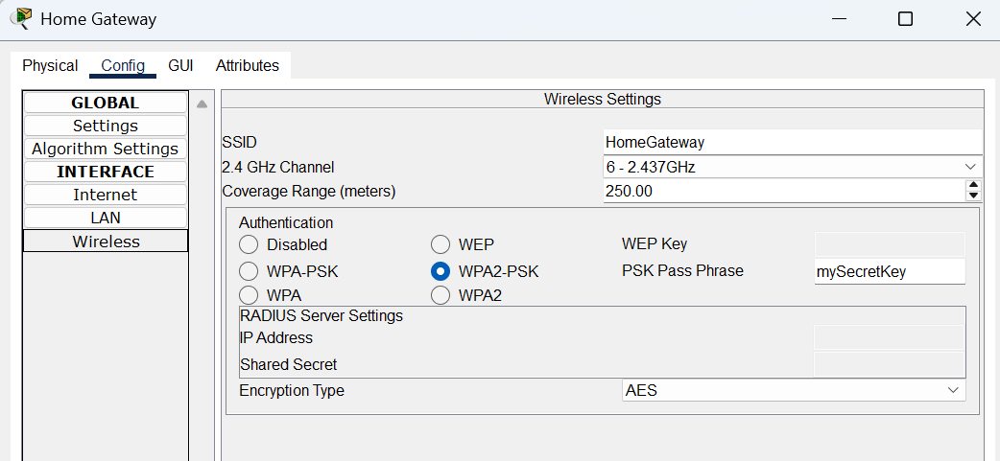
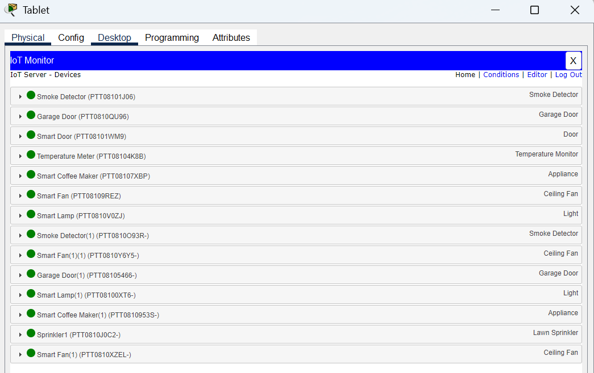
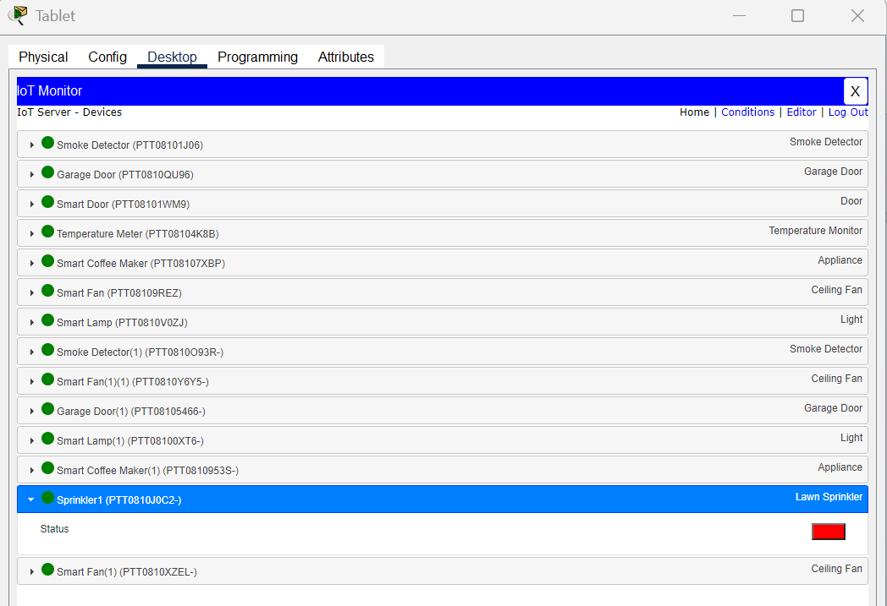
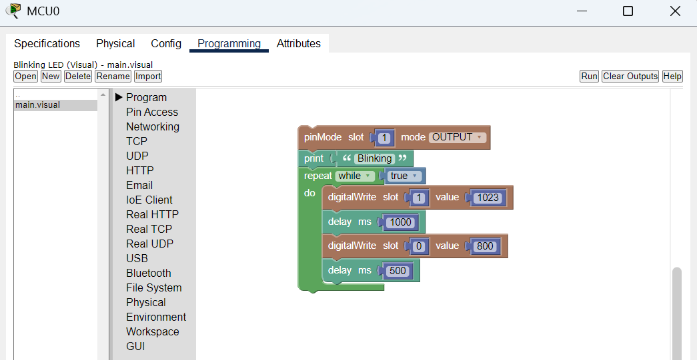
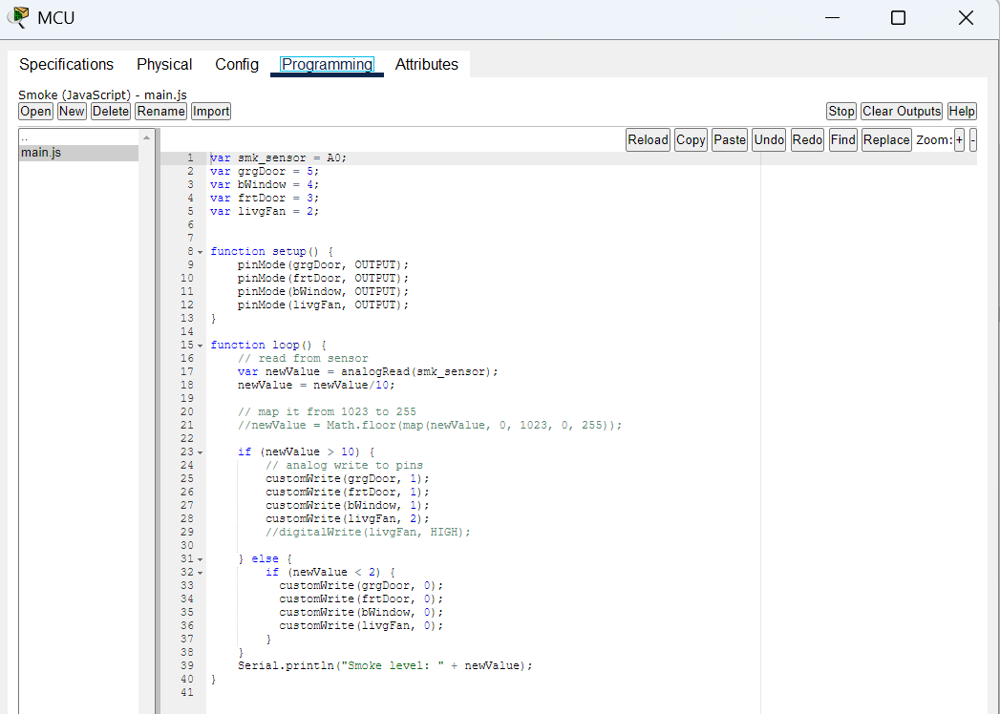

# Smart Home IoT Network Simulation

Cisco Packet Tracer in-class IoT lab project demonstrating smart home device connectivity, Home Gateway review, IoT device registration, Tablet IoT Monitor usage, and basic MCU/LED automation using Blockly.

---

## Project Overview

This project was completed as an in-class practical/lab activity for **CAB222 NETWORKS** at **Queensland University of Technology (QUT)** during **Semester 2, 2025**.

The lab introduces basic Internet of Things (IoT) concepts using a simulated smart home network in Cisco Packet Tracer. The project focuses on exploring connected smart home devices, reviewing Home Gateway settings, registering IoT devices, monitoring devices through a tablet-based IoT Monitor, and programming simple MCU-controlled LED devices using Blockly.

This repository presents the project as a class-based IoT practical. The goal is to document what the lab demonstrates, what devices are involved, and what technical skills were practiced.

---

## What This Project Demonstrates

The Packet Tracer file represents a smart home environment where IoT devices connect to a central **Home Gateway**.

The Home Gateway acts as the main smart home network device. It provides local network connectivity, wireless access, and IoT device registration. A **Tablet** is used to access the **IoT Monitor**, where registered smart devices can be viewed and controlled.

The project also includes a basic automation section where an **MCU board** is connected to LED devices and programmed using Blockly.

---

## Course Context

- **Course Name:** NETWORKS
- **Course Code:** CAB222
- **Term / Time:** Semester 2, 2025
- **Institution:** Queensland University of Technology (QUT)
- **Tool Used:** Cisco Packet Tracer

---

## Main Project Components

| Component | Purpose |
|---|---|
| Home Gateway | Central device for smart home connectivity, wireless access, and IoT registration |
| Cable Modem | Simulates external network or internet connectivity |
| Tablet | Used to access the IoT Monitor and manage smart devices |
| Smart Fan | Example smart actuator controlled through the IoT system |
| Smart Lamp | Smart lighting device |
| Smart Door | IoT-controlled door device |
| Garage Door | IoT-controlled garage access device |
| Temperature Monitor | Sensor device used to monitor temperature |
| Smoke Detector | Smart safety sensor |
| Smart Coffee Maker / Appliance | Example controllable smart appliance |
| Lawn Sprinkler | Wireless IoT device added and registered during the lab |
| Solar Panel | Simulated smart energy device |
| Battery | Simulated energy storage device |
| MCU Board | Microcontroller used for simple automation logic |
| LED / RGB LED | Actuator devices controlled using Blockly programming |

---

## Network and IoT Flow

The project can be understood in this simple flow:

```text
Internet / Cloud
      |
Cable Modem
      |
Home Gateway
      |
Smart Home IoT Network
      |
Tablet + Sensors + Actuators + MCU Devices
```

The smart home devices connect to the Home Gateway. The Tablet connects to the IoT server through the IoT Monitor and displays registered devices. The MCU section demonstrates how simple output devices such as LEDs can be controlled through programmed logic.

---

## Key Activities Completed

### 1. Explored the Smart Home Network

The lab began with an existing smart home topology in Cisco Packet Tracer. The network included common smart home IoT devices such as a fan, lamp, smoke detector, temperature monitor, smart door, garage door, solar panel, battery, and smart appliance.

### 2. Reviewed Home Gateway Settings

The Home Gateway was inspected to review the smart home network settings, including:

- LAN IP address
- Subnet mask
- Wireless SSID
- Wireless security mode
- WPA2-PSK passphrase
- IoT server settings

### 3. Used the Tablet IoT Monitor

The Tablet was used to open the IoT Monitor and connect to the smart home IoT server. From the IoT Monitor, connected smart devices could be viewed, checked, and controlled.

### 4. Added a Wireless IoT Device

A Lawn Sprinkler was added to the smart home network as an additional wireless IoT device. It was configured to connect to the Home Gateway, registered with the IoT server, and verified through the Tablet IoT Monitor.

### 5. Programmed MCU-Controlled LED Devices

The lab also introduced basic MCU programming. An MCU board was connected to LED devices using IoT custom cables. Blockly was used to control LED blinking, brightness, and RGB color behavior.

---

## Skills Learned and Demonstrated

This project demonstrates foundational skills in:

- Exploring a Cisco Packet Tracer smart home IoT topology
- Identifying IoT devices, sensors, actuators, and infrastructure components
- Reviewing Home Gateway LAN and wireless settings
- Understanding basic smart home network connectivity
- Connecting wireless IoT devices to a Home Gateway
- Registering IoT devices with an IoT server
- Using the Tablet IoT Monitor to view and control smart devices
- Verifying IoT device connectivity and registration
- Adding and configuring a wireless Lawn Sprinkler IoT device
- Connecting MCU boards to actuators using IoT custom cables
- Using Blockly visual programming for MCU automation
- Testing digital and analog output behavior
- Controlling LED and RGB LED devices
- Documenting an in-class networking/IoT lab project for GitHub

---

## Testing and Validation

| Test / Activity | Result |
|---|---|
| Opened and explored the existing smart home topology | Completed |
| Reviewed Home Gateway LAN and wireless settings | Completed |
| Logged into the Tablet IoT Monitor | Completed |
| Viewed registered smart home devices | Completed |
| Added the Lawn Sprinkler IoT device | Completed |
| Connected the Lawn Sprinkler to the Home Gateway | Completed |
| Verified the Lawn Sprinkler in the IoT Monitor | Completed |
| Connected MCU board to LED actuator | Completed |
| Ran Blockly LED control program | Completed |
| Tested RGB LED control logic | Completed |

---

## Repository Contents

```text
smart-home-iot-network-simulation/
|
|-- README.md
|-- Smart_Home_Network.pkt
|-- Prac8_IoT_v3.pdf
|
|-- screenshots/
|   |-- 01-topology-overview.png
|   |-- 02-home-gateway-lan-settings.png
|   |-- 03-home-gateway-wireless-settings.png
|   |-- 04-tablet-iot-monitor-devices.png
|   |-- 05-sprinkler-device-status.png
|   |-- 06-mcu-led-program.png
|   |-- 07-mcu-smoke-automation-code.png
```
---

## How to Open the Project

1. Install **Cisco Packet Tracer**.
2. Download or clone this repository.
3. Open the file:

```text
Smart_Home_Network.pkt
```

4. Review the smart home topology in the Logical workspace.
5. Open the Tablet device and launch the IoT Monitor.
6. Open the MCU device to review the Blockly program.

---

## Screenshots

### 1. Topology Overview


### 2. Home Gateway LAN Settings


### 3. Home Gateway Wireless Settings


### 4. Tablet IoT Monitor Devices


### 5. Sprinkler Device Status


### 6. MCU LED Program


### 7. MCU Smoke Automation Code


---

## Project Scope

This is an in-class IoT practical focused on foundational smart home networking and automation concepts. It is not intended to represent a production-ready secure smart home design.

A separate future project will be built from scratch to demonstrate a more advanced secure smart home network with stronger segmentation, access control, and security-focused design.

---

## Project Status

Completed as an in-class IoT practical and organized for GitHub documentation.

---

## Author

**Ehsan**  
Computing Science Student  
Networking | Cybersecurity | IT Support & Operations